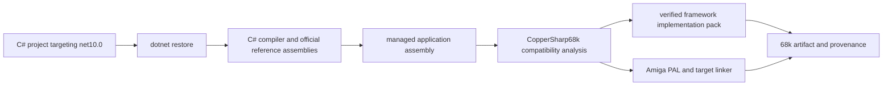

# SDK, restore, build, and publishing

## Developer experience

A CopperSharp68k application is an ordinary SDK-style C# project targeting `net10.0`. It restores the official .NET reference pack plus CopperSharp68k SDK/runtime packages, compiles managed IL with the normal C# toolchain, and invokes the CopperSharp68k compiler for compatibility analysis and target emission.



The application does not reference a replacement core library and does not need target framework monikers invented solely for the Amiga.

## Package roles

The publishing surface is split by responsibility:

| Package role | Contents |
|---|---|
| SDK | MSBuild targets, tasks, default properties, compatibility invocation, and publish integration |
| Compiler tool | CLI/compiler executable and target emitters |
| Contract | machine-readable exact .NET 10 binding manifest |
| Implementation pack | pinned managed implementation assemblies plus hashes and mapping manifest |
| Runtime/PAL | private runtime objects, shadows, PAL implementations, and link inputs |
| Amiga SDK | optional public declarations for applications that intentionally call Amiga APIs |

Packages may be delivered together during preview releases, but their version axes and logical boundaries remain distinct.

## Minimal project

```xml
<Project Sdk="Microsoft.NET.Sdk">
  <PropertyGroup>
    <OutputType>Exe</OutputType>
    <TargetFramework>net10.0</TargetFramework>
    <RuntimeIdentifier>amiga-m68k</RuntimeIdentifier>
    <SelfContained>false</SelfContained>
    <UseAppHost>false</UseAppHost>
    <Copper68kCpu>M68000</Copper68kCpu>
  </PropertyGroup>

  <ItemGroup>
    <PackageReference Include="CopperSharp68k.Sdk" Version="0.1.0-preview.1" />
  </ItemGroup>
</Project>
```

The SDK owns the exact package graph needed by the selected release coordinate. Applications should not independently choose a different implementation pack.

## Runtime identifier policy

`amiga-m68k` describes the target platform and is intentionally separate from `net10.0`. Restore uses RID-specific CopperSharp68k assets and may fall back only to RID-agnostic managed assets explicitly marked `any`.

Microsoft host publishing features are not target emitters for this toolchain. The SDK rejects conflicting requests such as `PublishAot`, `PublishSingleFile`, `PublishTrimmed`, a host app launcher, or `SelfContained=true` when they would cause the .NET SDK to construct an unrelated native application.

## Stable project properties

The SDK exposes a small stable property set:

| Property | Purpose |
|---|---|
| `Copper68kCpu` | selects MC68000/020/040/060 lowering |
| `Copper68kOutputKind` | selects HUNK application, assembler, or ROM-oriented output |
| `Copper68kCompatibilityManifest` | overrides the contract only for controlled toolchain testing |
| `Copper68kImplementationPack` | overrides the implementation pack only for controlled toolchain testing |
| `Copper68kEmitMap` | emits reachability, feature, size, allocation, spill, and cycle data |
| `Copper68kEmitProvenance` | emits the reproducibility manifest |

Additional experimental switches must not become an implicit public compatibility contract.

## Build and publish behavior

`dotnet build` produces the managed assembly and runs compatibility validation when target emission is enabled. `dotnet publish -r amiga-m68k` performs the complete target pipeline:

1. restore the exact SDK, reference, contract, implementation, runtime, and PAL assets;
2. compile the application assembly;
3. write a response manifest containing ordered roots and dependencies;
4. reject duplicate managed assembly identities and ambiguous provenance;
5. validate the reference and implementation coordinates and hashes;
6. analyze the complete closed-world graph once;
7. emit the target artifact, map, diagnostics, and provenance into a staging directory;
8. atomically replace the final publish outputs after successful completion.

Build failure must not leave a partially updated executable that appears publishable.

## Response manifest and dependency closure

The SDK passes the compiler an explicit response manifest rather than relying on directory scans. It contains:

- application roots and entry point;
- ordered managed dependencies with identity and hash;
- contract and implementation-pack manifests;
- runtime/PAL link inputs;
- target CPU and output kind;
- requested diagnostic, map, and provenance outputs.

The compiler validates that a managed identity resolves to exactly one file. Dependency closure is determined from metadata and the response manifest, not from whichever DLL happens to be found first on the build host.

## Incrementality

MSBuild inputs include application/dependency hashes, compiler and SDK versions, contract and implementation manifests, target properties, runtime/PAL inputs, and relevant linker settings. Outputs include the final artifact, map, diagnostics stamp, and provenance file.

A no-op build may skip compilation only when the complete input fingerprint matches. Compatibility analysis and code generation share one resolved graph; the SDK must not run independent analyses that can disagree.

## Provenance

Each successful artifact records enough information to reproduce and audit it:

- compiler, SDK, and package versions;
- target framework, reference-pack version, RID, CPU, and output kind;
- contract schema and content hash;
- implementation profile, manifest hash, and implementation assembly hashes;
- application and dependency identities and hashes;
- private runtime ABI generation;
- selected feature groups and PAL groups;
- linker/output options and final artifact hash.

Machine-readable provenance is part of the release evidence and compatibility-report format.

## Efficiency requirements

SDK integration must preserve the target design's efficiency:

- restore and graph resolution happen on the host;
- the compiler analyzes one closed-world graph per target build;
- implementation assemblies are trimmed by method reachability;
- package layout does not force unused runtime or PAL groups into the link;
- the target artifact contains no NuGet, MSBuild, metadata loader, or runtime assembly resolver.

## Non-goals

The SDK does not promise compatibility with desktop .NET workloads, arbitrary NuGet packages, CoreCLR-native hosting, Microsoft NativeAOT output, or libraries that require unsupported reflection, dynamic loading, P/Invoke, threading, globalization, or operating-system services. Compatibility is decided by reachable exact members, not merely by a package's target framework declaration.
